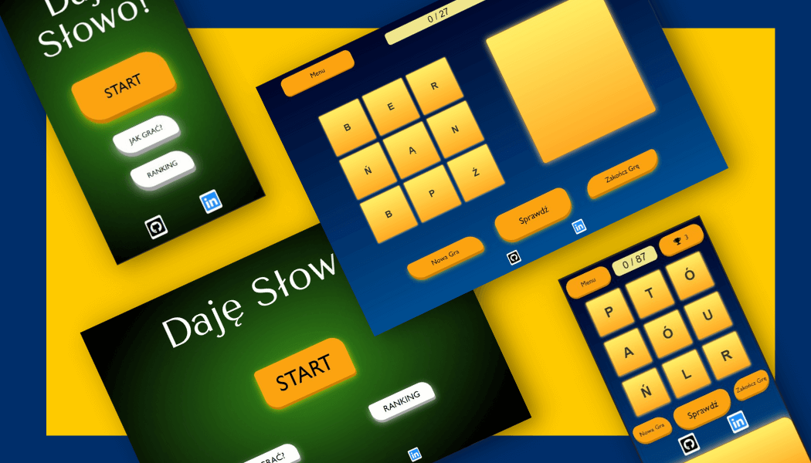

# Daje Slowo - Word's Game

Created with vanilla js, MongoDB, SimpleBar library . To practice OOP. Hope you like it! :)

## Introduction

I've created it to practice Object Oriented Programming, and other elements of JavaScript language. I had a lot of fun creating it!

This is a game where you need to find as many words as possible from the given letters. Game is in polish.*

#### app is fully responsive

\*if you open console - you'll see all words, that you can create. 

## Technologies

* JavaScript

* [MongoDB](https://www.mongodb.com/)

* RegEx

* [FontsAwesome](https://fontawesome.com/)

* [SimpleBar Library](https://grsmto.github.io/simplebar/)

## Features

* App contains a welcome menu where you can find buttons to see rules of the game and current saved ranking score. You can also start the game. 

* Score ranking saved in browser local storage.

* Page background mask appearing any time you open ranking, game rules or show prompt.

* App is fetching all corect words from dictionary that I stored in MongoDB.

* Spinner apears whenever fetching data from database.

* Prompt with different content at the end of the game depending on your result. 

* List of correctly guessed words. - The list grows each time you guess correct word. When you end the game all words you didn't guess will be also shown on the list.

* Customized scroll bar with SimbleBar library.

* Game is counting your score and shows maximum possible score you can achieve with given letters.

* RegEx used to find correct words.

* App contains animations.

* Singleton to control Game Logic. ("One to rule them all!" ;))

* app contains some modern JS features like: 

1) async/await functions,

2) classes,

3) sort, map, for_each, includes, filter, fetch

#### Buttons

On board besides of letters buttons you have other function buttons:

* at the top you have 2 buttons:

1) Menu - you will start over from welcome page

2) Ranking - It shows the highest score stored in local storage. When you press it, ranking will appear.

* at the bottom you have 3 buttons:

1) new game - draw new letters, send new 'GET' reqest to dictionary database. Reset current score without checking if you earn enought points to be recorded in ranking. Enable disabled buttons.

2) check - check if created word is correct.

3) end the game - end the game with earned points. Check if you earned enought points to be recorden in ranking. Disable all buttons that are not needed after ending the game.

## Screenshots

 

## Launch

### Live demo

You can see deployed live demo [_here_](https://dajeslowo-wordgame.web.app/)

 
### Localy

To run this project clone this repo to your desktop and open `index.html` in your browser.

## Project status

It's finished! :) But some elements could be upgraded.

## Contact

 Created by [@PawelBak](https://pawel-bak-portfolio.web.app/) - feel free to contact me!